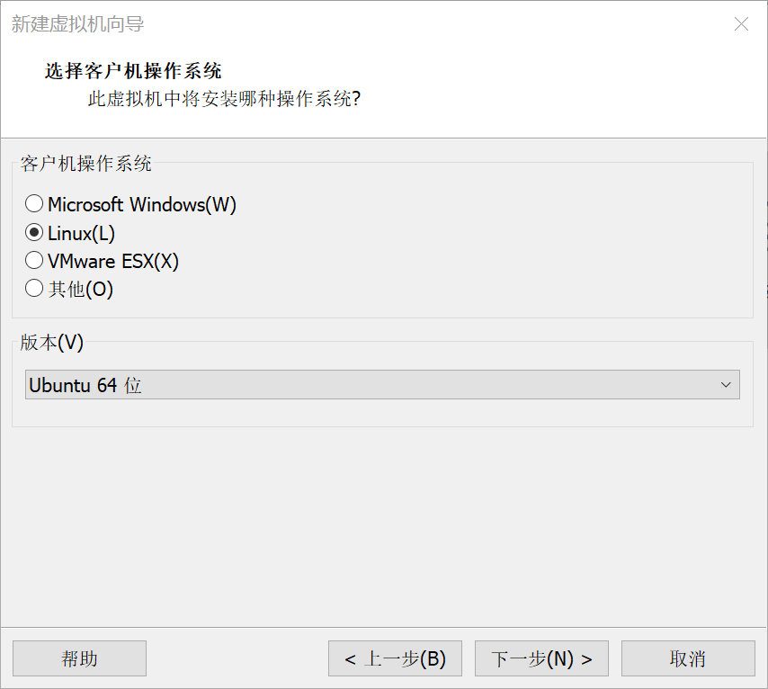
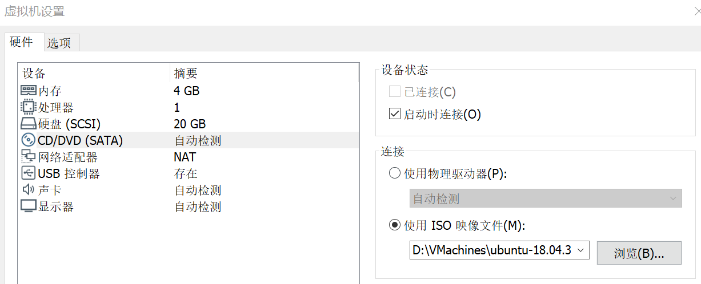
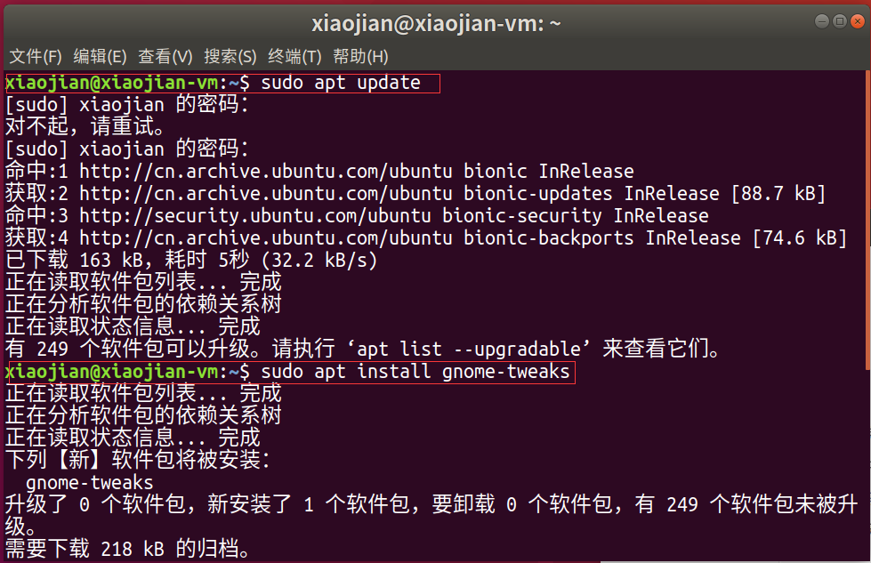
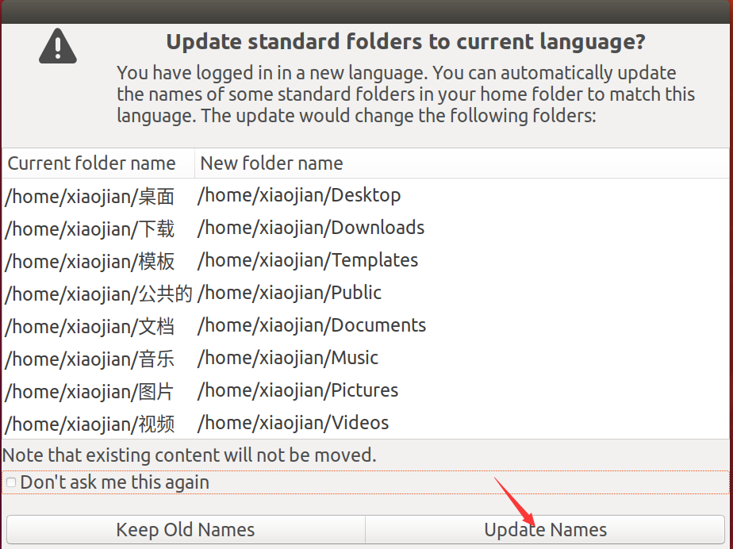

# Linux的笔记
<!-- MarkdownTOC -->

- [Vmware使用笔记](#vmware使用笔记)
    - [1 创建虚拟机](#1-创建虚拟机)
        - [1.1 选择自定义来创建一个空的系统](#11-选择自定义来创建一个空的系统)
        - [1.2 载入镜像文件装系统](#12-载入镜像文件装系统)
        - [1.3 取消镜像文件依赖](#13-取消镜像文件依赖)
    - [2 安装 VMware Tools](#2-安装-vmware-tools)
    - [3 改变系统分辨率，图标，字体](#3-改变系统分辨率，图标，字体)
        - [3.1 改变分辨率](#31-改变分辨率)
        - [3.2 改变图标大小](#32-改变图标大小)
        - [3.3 改变字体大小](#33-改变字体大小)
    - [4 系统文件夹改为英文](#4-系统文件夹改为英文)
- [Ubuntu 使用笔记](#ubuntu-使用笔记)
    - [1 Ubuntu 没网](#1-ubuntu-没网)
        - [1.1 打开VMware的服务](#11-打开vmware的服务)
        - [1.2 重置Ubuntu网络状态](#12-重置ubuntu网络状态)
- [MySQL 使用笔记](#mysql-使用笔记)
    - [1 装mysql没有设置密码](#1-装mysql没有设置密码)
- [SSH 使用笔记](#ssh-使用笔记)
    - [1 服务器连接](#1-服务器连接)
        - [1.1 使用密码连接](#11-使用密码连接)
        - [1.2 使用密钥连接](#12-使用密钥连接)
    - [2 文件传输](#2-文件传输)
        - [2.1 安装lrzsz](#21-安装lrzsz)
        - [2.2 安装zssh](#22-安装zssh)
        - [2.3 实例](#23-实例)
- [Git 使用笔记](#git-使用笔记)
    - [1 Git 第一次使用](#1-git-第一次使用)
        - [1.1 仓库建立](#11-仓库建立)
        - [1.2 上传](#12-上传)
        - [1.3 同步](#13-同步)
    - [2 Git与Gitee同时使用](#2-git与gitee同时使用)

<!-- /MarkdownTOC -->


<a id="vmware使用笔记"></a>
## Vmware使用笔记
<a id="1-创建虚拟机"></a>
### 1 创建虚拟机  
首先创建一个空的系统，再用ISO镜像文件去安装。基本上是按照引导就可以装好了，下面是一些关键的步骤：

<a id="11-选择自定义来创建一个空的系统"></a>
#### 1.1 选择自定义来创建一个空的系统
 
 


<a id="12-载入镜像文件装系统"></a>
#### 1.2 载入镜像文件装系统  
启动虚拟机前，配置好ISO镜像的路径  

 

启动虚拟机，选择中文语言，并安装Ubuntu，然后一直下一步。输入用户名和密码后进入安装，不要点Skip，一直等到安装完成。

 

安装完成后重启即可进入操作系统

<a id="13-取消镜像文件依赖"></a>
#### 1.3 取消镜像文件依赖
关闭虚拟机，将使用ISO镜像改为使用物理驱动，并取消连接即可  
  

<a id="2-安装-vmware-tools"></a>
### 2 安装 VMware Tools
在VMware选择 &rarr; 虚拟机&rarr;安装 VMware Tools &rarr;打开桌面上的光盘 &rarr;复制左图的压缩包到桌面，解压 &rarr; sudo运行右图文件，安装成功  

 


<a id="3-改变系统分辨率，图标，字体"></a>
### 3 改变系统分辨率，图标，字体

<a id="31-改变分辨率"></a>
#### 3.1 改变分辨率

方法很多，最直接的是：  在VMware选择查看&rarr;立即适应客户机
<a id="32-改变图标大小"></a>
#### 3.2 改变图标大小

 
<a id="33-改变字体大小"></a>
#### 3.3 改变字体大小

首先安装优化程序,打开后即可设置字体大小  
   
  
<a id="4-系统文件夹改为英文"></a>
### 4 系统文件夹改为英文

首先将系统语言改为英文，确认更改文件夹名字  
   
然后重复一遍，将系统语言改为中文，选择不更改文件夹名字并不再询问


<a id="ubuntu-使用笔记"></a>
## Ubuntu 使用笔记

<a id="1-ubuntu-没网"></a>
### 1 Ubuntu 没网

<a id="11-打开vmware的服务"></a>
#### 1.1 打开VMware的服务

  

<a id="12-重置ubuntu网络状态"></a>
#### 1.2 重置Ubuntu网络状态

```
# 重置网络状态
sudo service network-manager stop
sudo rm /var/lib/NetworkManager/NetworkManager.state
sudo service network-manager start

# 如果还没网
sudo gedit /etc/NetworkManager/NetworkManager.conf把false改成true
sudo service network-manager restart
```

<a id="mysql-使用笔记"></a>
## MySQL 使用笔记

<a id="1-装mysql没有设置密码"></a>
### 1 装mysql没有设置密码

```
# 1 查看默认用户和密码
sudo cat /etc/mysql/debian.cnf 
mysql -u debian-sys-maint
# 2 连接到mysql数据库
mysql> use mysql;    
# 3 修改root用户密码               
mysql> update mysql.user set authentication_string=password('123456') where user='root' and Host ='localhost';
# 4 更新    
mysql> update user set plugin="mysql_native_password";     
mysql> flush privileges;
# 5 退出
mysql> quit; 
```


<a id="ssh-使用笔记"></a>
## SSH 使用笔记

<a id="1-服务器连接"></a>
### 1 服务器连接

<a id="11-使用密码连接"></a>
#### 1.1 使用密码连接

```
# 输入密码
ssh root@39.105.40.238
```

<a id="12-使用密钥连接"></a>
#### 1.2 使用密钥连接

```
# pem为密钥文件
ssh root@39.105.40.238 -i p3.pem
```

<a id="2-文件传输"></a>
### 2 文件传输

<a id="21-安装lrzsz"></a>
#### 2.1 安装lrzsz

安装后，使用**rz,sz**命令即可进行文件传输，需要**终端支持**才可以（如：XShell等软件），如果只是命令行终端则需要安装**zssh**
```
# 安装lrzsz
sudo apt-get install lrzsz
# rz recieve 接受文件
rz
# sz send 上传文件，不支持文件夹
sz filename
```

<a id="22-安装zssh"></a>
#### 2.2 安装zssh

```
# 安装zssh
sudo apt-get install zssh
```
使用rz和sz的时候可能会遇到**乱码**，如果时zssh连接时使用 **Ctrl + 2** 快捷键即可

<a id="23-实例"></a>
#### 2.3 实例

**服务器A**与**电脑B**之间要传输文件，服务器A要在**fa文件夹**下接收B电脑**fb文件夹**的**file文件**
```
# 1 进入fb文件夹，并使用zssh连接服务器
B\fb> zssh root@39.105.40.238 -i p3.pem

# 2 进入fa文件夹，并使用rz
A\fa> rz

# 3 按Ctrl+2进入zssh，并查看当前目录
zssh> pwd   //可知当前目录为B\fb

# 4 发送file文件
zssh> sz file

# 5 退出
zssh> quit
```

<a id="git-使用笔记"></a>
## Git 使用笔记

<a id="1-git-第一次使用"></a>
### 1 Git 第一次使用

<a id="11-仓库建立"></a>
#### 1.1 仓库建立

首先要在GitHub或者Gitee上创建一个**新远程仓库**

```
# 1 在Linux上安装Git
sudo apt-get install git

# 2 在初始化本地仓库
git init

# 3 Git的全局或本仓库配置
git config --global user.name "Jian-Xiao"   //没有global就只针对本仓库
git config --global user.email "email@qq.com"

# 4 为本地仓库指定远程仓库
git remote add origin https://gitee.com/Jian-Xiao/Segment.git
```

<a id="12-上传"></a>
#### 1.2 上传

至此，本地仓库已经与远程仓库建立连接，接下来就是**上传**文件

```
# 1 将工作区文件添加到暂存区
git add README.md   //将单个改动放入暂存区
git add .           //将所有改动放入暂存区

# 2 将暂存区提交到本地仓库
git commit -m "填写提交说明" 

# 3 将本地仓库推送到远程仓库的master分支
git push origin master

```

<a id="13-同步"></a>
#### 1.3 同步
然后，也可以从远程仓库**同步**最新版本
```
# 1 将远程仓库克隆到本地
git clone https://gitee.com/Jian-Xiao/Segment

# 2 获取最新版本
git pull origin master

```


<a id="2-git与gitee同时使用"></a>
### 2 Git与Gitee同时使用

因为没有梯子，所以从GitHub上克隆很慢，所以**用Gitee导入了Github的仓库**，在克隆Gitee就很快。
```
# 1 克隆Gitee
git clone https://gitee.com/Jian-Xiao/Segment
```
但是很快就来了问题：**该本地仓库对应的是Gitee的远程仓库**。也就是`git push origin master`是传到**Gitee**上，那么有没有办法使得push可以传到GitHub上呢？
```
# 2 添加origin2
git remote add origin2 https://github.com/Jian-Xiao/Segment.git

# 3 同步到Gitee
git push origin master

# 4 同步到GitHub
git push origin2 master
```
不难发现origin、origin2都只是代表一个仓库地址罢了：

字段|地址
----|----
origin  | https://gitee.com/Jian-Xiao/Segment.git
origin2 | https://github.com/Jian-Xiao/Segment.git

注意，`https://gitee.com/Segment.git`和`https://gitee.com/Segment`没有区别
