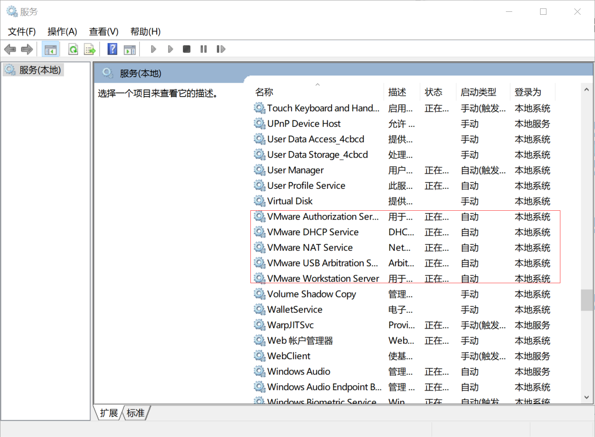

### 1 Ubuntu 没网
#### 1.1 打开VMware的服务
  

#### 1.2 重置Ubuntu网络状态
```
# 重置网络状态
sudo service network-manager stop
sudo rm /var/lib/NetworkManager/NetworkManager.state
sudo service network-manager start

# 如果还没网
sudo gedit /etc/NetworkManager/NetworkManager.conf把false改成true
sudo service network-manager restart
```

### 2 装mysql没有设置密码
```
# 1 查看默认用户和密码
sudo cat /etc/mysql/debian.cnf 
mysql -u debian-sys-maint
# 2 连接到mysql数据库
mysql> use mysql;    
# 3 修改root用户密码               
mysql> update mysql.user set authentication_string=password('123456') where user='root' and Host ='localhost';
# 4 更新    
mysql> update user set plugin="mysql_native_password";     
mysql> flush privileges;
# 5 退出
mysql> quit; 
```
