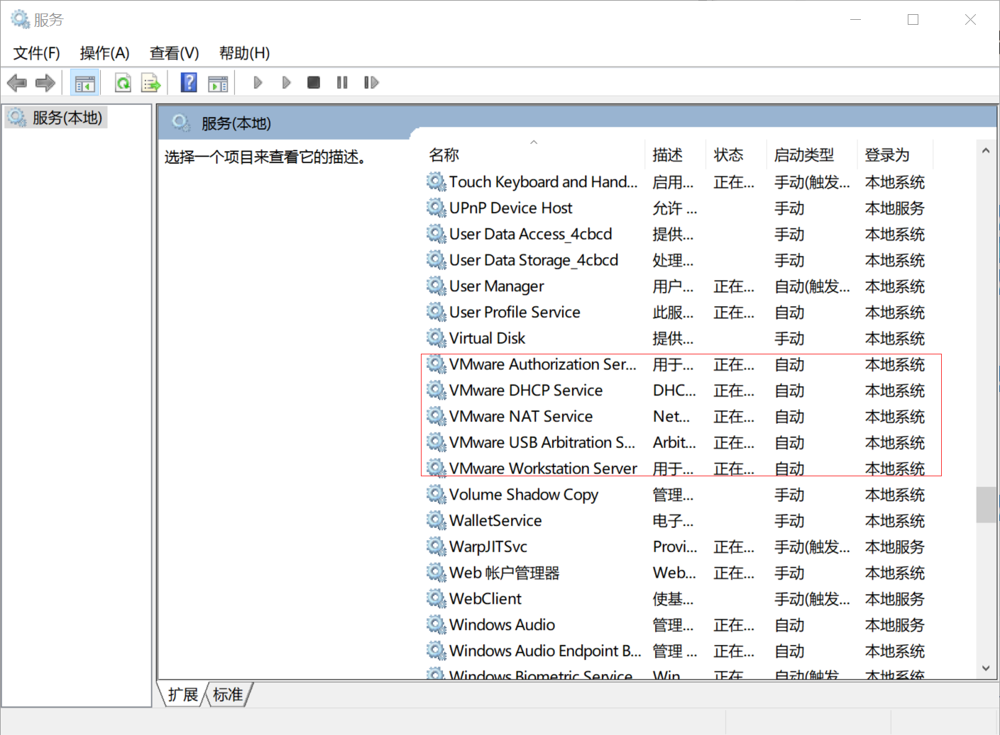

### 1 Ubuntu 没网
#### 1.1 打开VMware的服务
  

#### 1.2 重置Ubuntu网络状态
```
# 重置网络状态
sudo service network-manager stop
sudo rm /var/lib/NetworkManager/NetworkManager.state
sudo service network-manager start

# 如果还没网
sudo gedit /etc/NetworkManager/NetworkManager.conf把false改成true
sudo service network-manager restart
```

