# Vmware使用笔记
<!-- MarkdownTOC -->

- [1 创建虚拟机](#1-创建虚拟机)
    - [1.1 选择自定义来创建一个空的系统](#11-选择自定义来创建一个空的系统)
    - [1.2 载入镜像文件装系统](#12-载入镜像文件装系统)
    - [1.3 取消镜像文件依赖](#13-取消镜像文件依赖)
- [2 安装 VMware Tools](#2-安装-vmware-tools)
- [3 改变系统分辨率，图标，字体](#3-改变系统分辨率，图标，字体)
    - [3.1 改变分辨率](#31-改变分辨率)
    - [3.2 改变图标大小](#32-改变图标大小)
    - [3.3 改变字体大小](#33-改变字体大小)
- [4 系统文件夹改为英文](#4-系统文件夹改为英文)

<!-- /MarkdownTOC -->

### 1 创建虚拟机  

---

首先创建一个空的系统，再用ISO镜像文件去安装。基本上是按照引导就可以装好了，下面是一些关键的步骤：

#### 1.1 选择自定义来创建一个空的系统
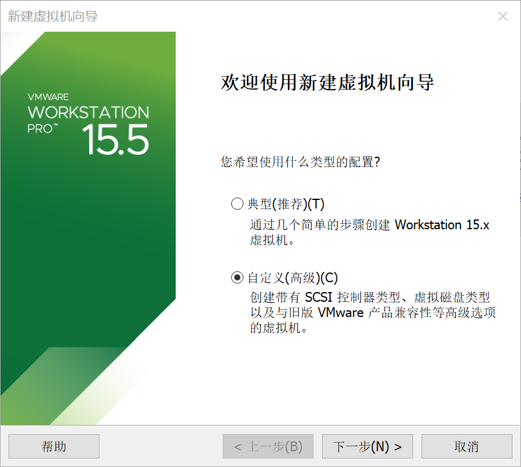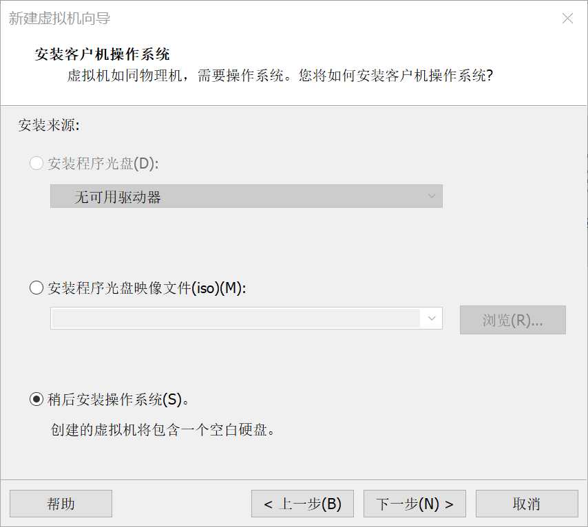
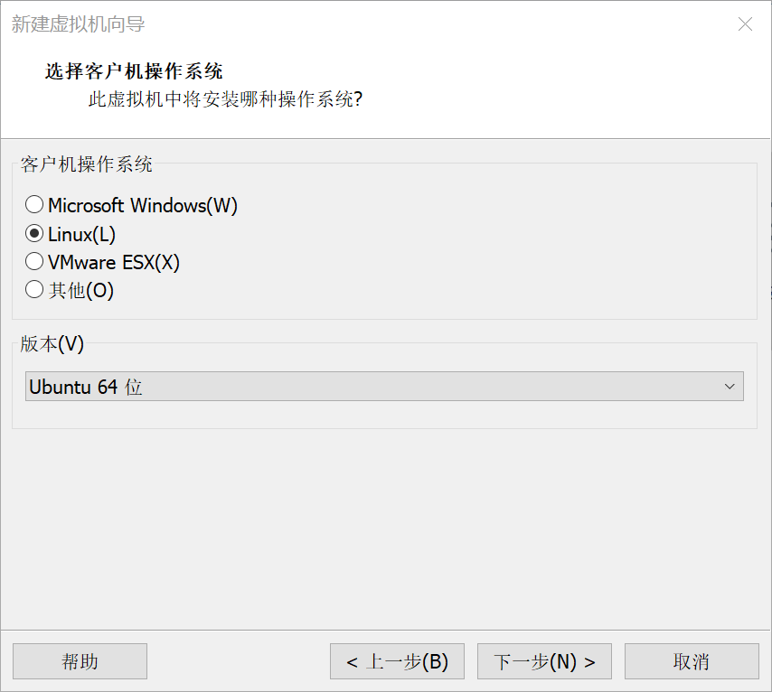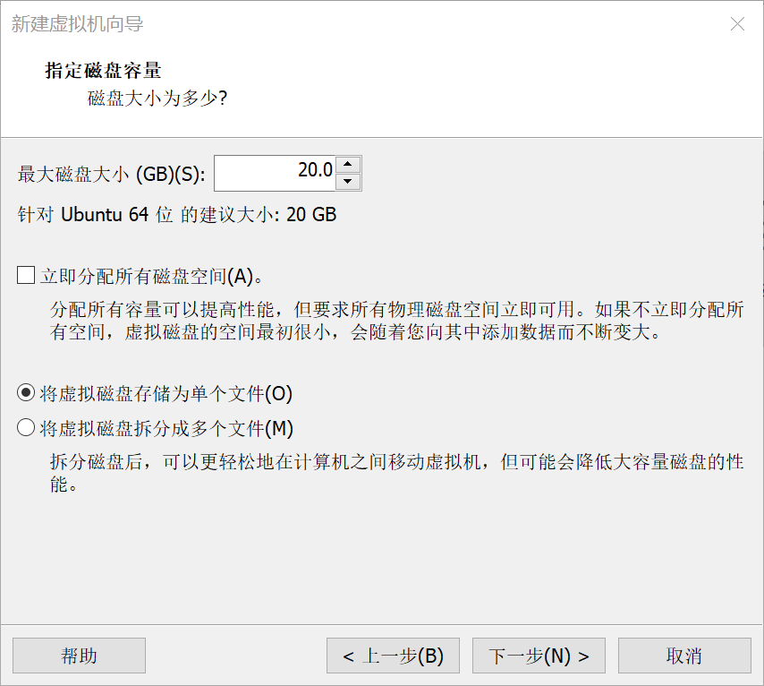

#### 1.2 载入镜像文件装系统  
启动虚拟机前，配置好ISO镜像的路径  

 

启动虚拟机，选择中文语言，并安装Ubuntu，然后一直下一步。输入用户名和密码后进入安装，不要点Skip，一直等到安装完成。

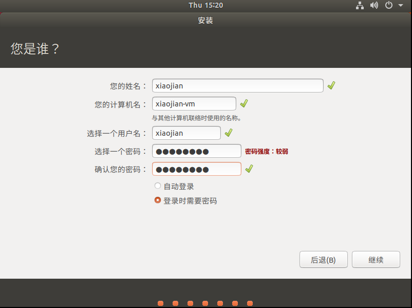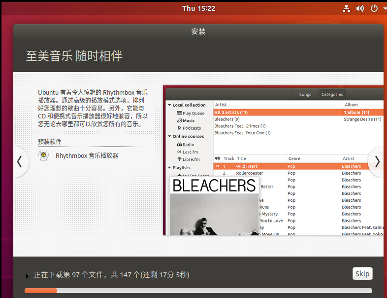

安装完成后重启即可进入操作系统

#### 1.3 取消镜像文件依赖
关闭虚拟机，将使用ISO镜像改为使用物理驱动，并取消连接即可  
  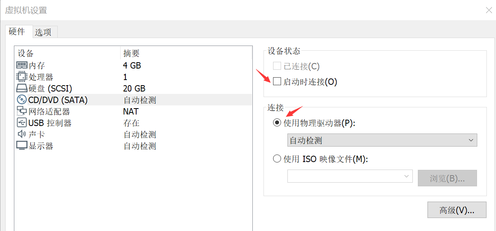

### 2 安装 VMware Tools

---

在VMware选择 &rarr; 虚拟机&rarr;安装 VMware Tools &rarr;打开桌面上的光盘 &rarr;复制左图的压缩包到桌面，解压 &rarr; sudo运行右图文件，安装成功  

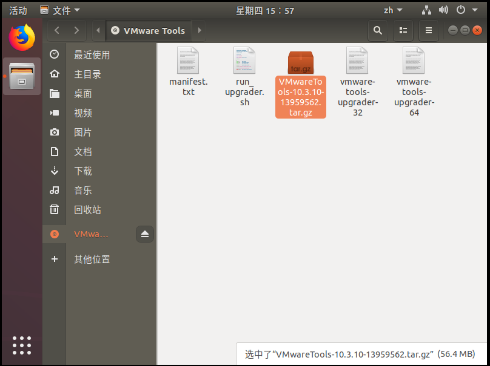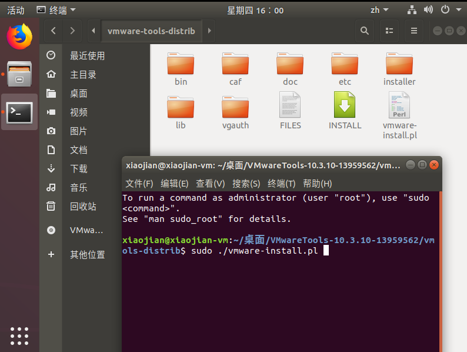

### 3 改变系统分辨率，图标，字体

---

#### 3.1 改变分辨率
方法很多，最直接的是：  在VMware选择查看&rarr;立即适应客户机

#### 3.2 改变图标大小
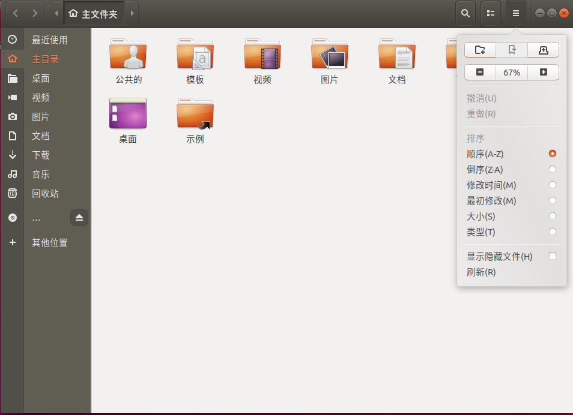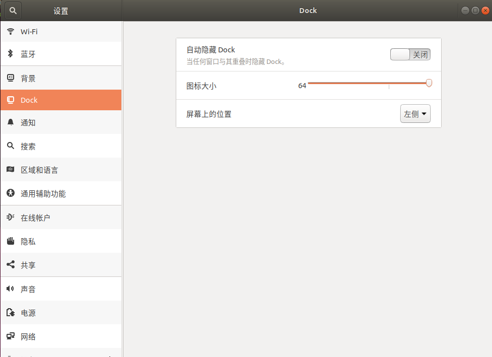

#### 3.3 改变字体大小
首先安装优化程序,打开后即可设置字体大小  
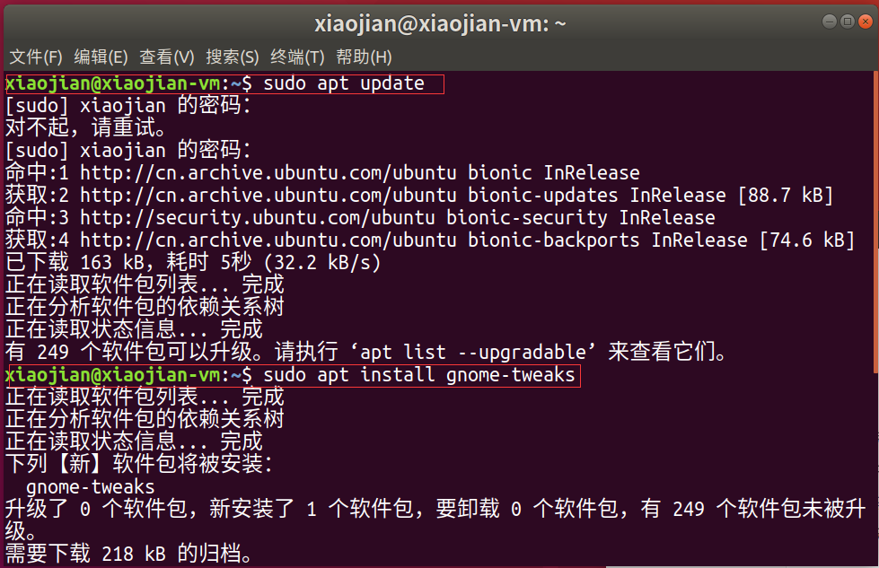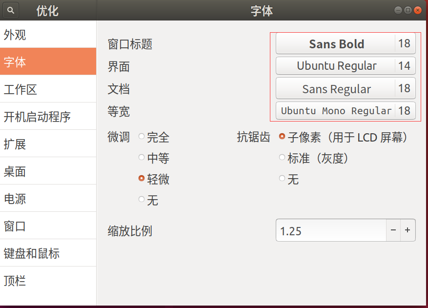  
  

### 4 系统文件夹改为英文

---

首先将系统语言改为英文，确认更改文件夹名字  
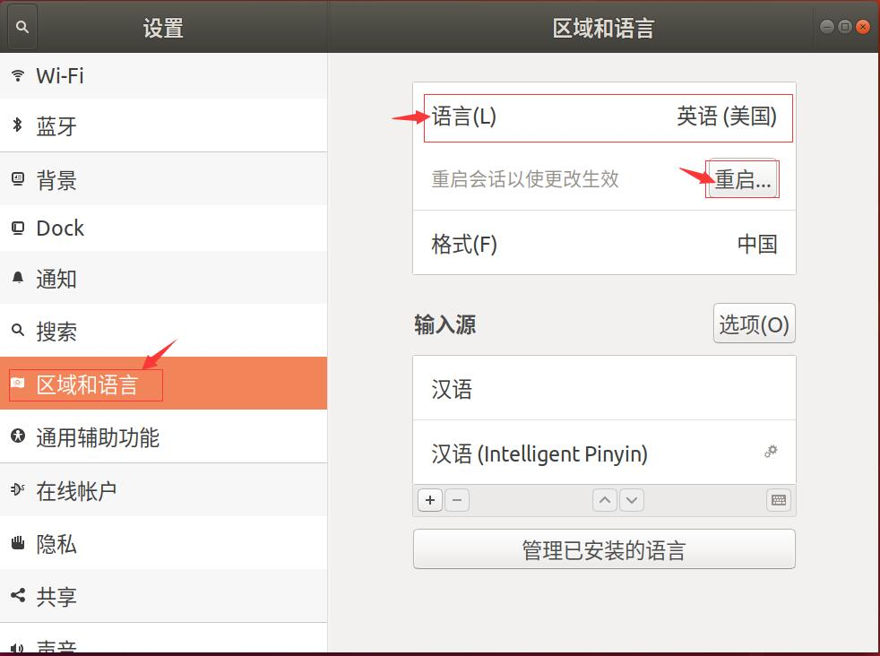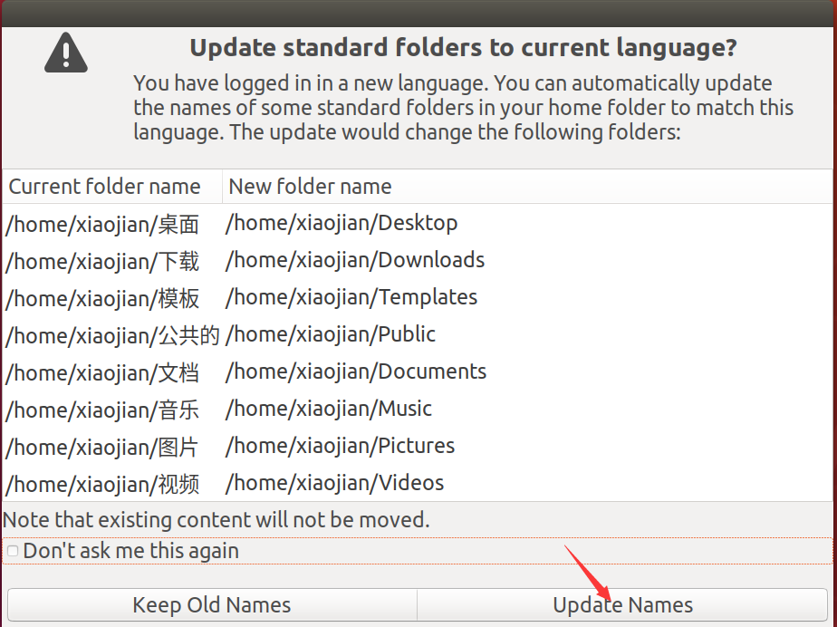  
然后重复一遍，将系统语言改为中文，选择不更改文件夹名字并不再询问